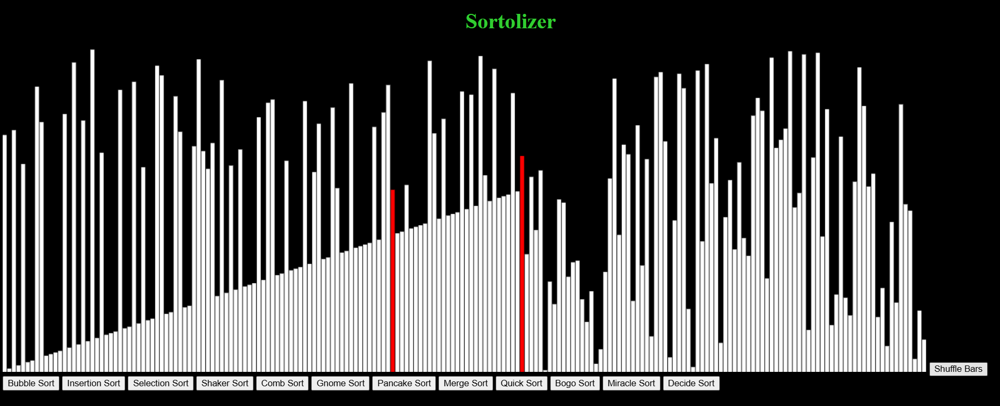
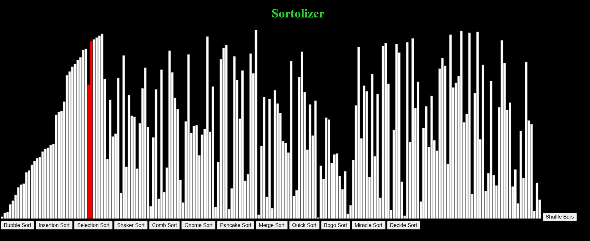
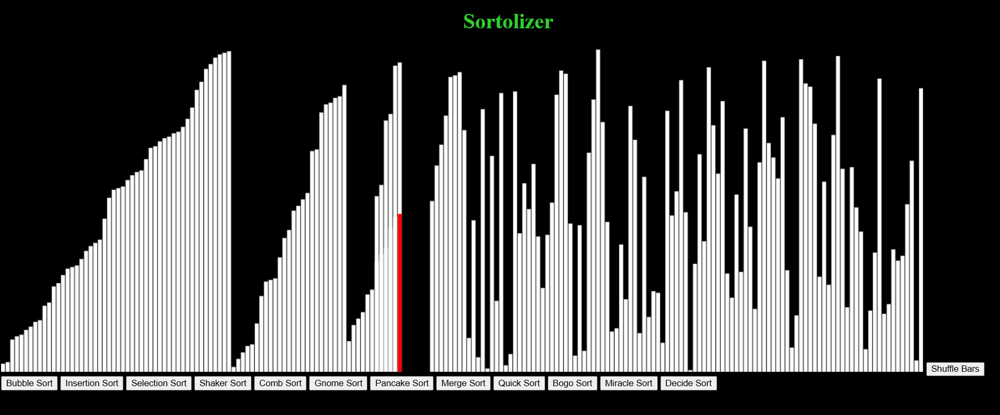
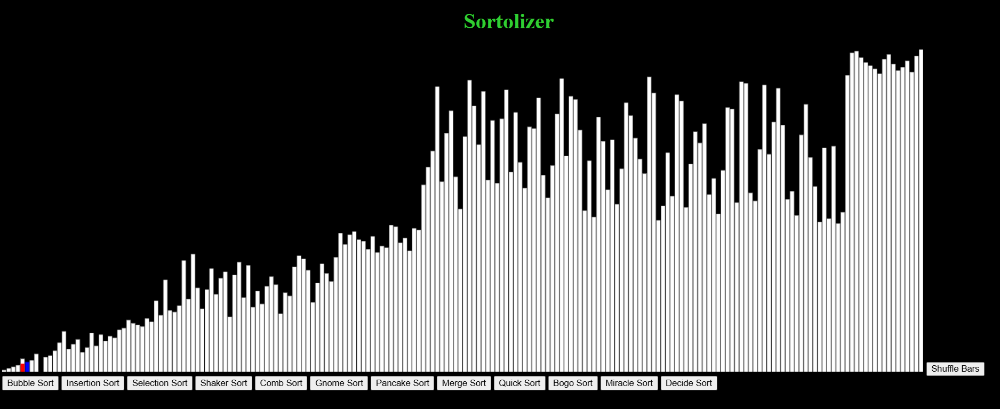

# Overview
The Sortoliser was created to serve as a learning tool to help people understand the process behind a variety of sorting algorithms. It is written primarily in JavaScript and designed to be used and interacted with as a webpage. I hoped that, by making this project, I would be able to learn more about JavaScript and learn a variety of common sorting algorithms myself.

# Features
* Full Visualisation of over ten different sorting algorithms
* Sound effects when bars are swapped

# Implemented Algorithms
* Fisher-Yates Shuffling

* Bubble Sort
* Insertion Sort
* Selection Sort
* Shaker Sort
* Comb Sort
* Gnome Sort
* Pancake Sort

* Merge Sort
* Quick Sort

* Bogo Sort
* Miracle Sort
* Decide Sort

# Screen Shots Of Program Operation

Shuffling the Bars:

Insertion Sort:

Merge Sort:

Quick Sort:

